# MAKERS: Multi Agent Knowledge Exploration & Retrieval System

[](https://www.python.org/downloads/)
[](https://opensource.org/licenses/MIT)

## 🚀 Overview

**MAKERS** is an advanced autonomous research system that combines Large Language Models (LLMs) with strategic tool orchestration. It leverages **LangGraph** for workflow orchestration, **LlamaIndex** for Retrieval Augmented Generation (RAG), **ChromaDB** for vector storage, and **SQLite** for persistent state management (LangGraph checkpoints).

### Core Capabilities

*   **Autonomous Research Agent**: Unified ReAct agent that dynamically orchestrates multiple information sources
*   **Multi-Source Retrieval**: Intelligent decision-making between ArXiv search (external) and knowledge base RAG (internal)
*   **Deep Document Analysis**: Specialized CrewAI team for comprehensive PDF analysis
*   **Stateful Workflows**: Persistent, resumable research sessions with SQLite checkpointing
*   **Long-Term Memory**: Conversation summarization prevents prompt explosion while preserving context

## 🏗️ Architecture

### System Architecture

The system implements a **multi-node LangGraph workflow** with separated concerns for agent reasoning, tool execution, and memory management:

```mermaid
flowchart TB
    Start([👤 User Request<br/>CLI/API]) --> AgentNode
    
    subgraph Workflow["🔄 LangGraph Workflow<br/>StateGraph with SQLite Checkpointing"]
        AgentNode["🤖 Agent Node<br/>━━━━━━━━━━━━━━━━<br/>📥 Input:<br/>• conversation_summary<br/>• recent messages<br/><br/>⚙️ Process:<br/>• ReAct Agent analysis<br/>• Decision making<br/><br/>📤 Output:<br/>• AIMessage with tool_calls<br/>OR final_answer"]
        
        AgentNode -->|"tool_calls detected"| ToolNode
        AgentNode -->|"final_answer"| EndNode
        
        ToolNode["🛠️ Tool Node<br/>━━━━━━━━━━━━━━━━<br/>📥 Extract tool_calls<br/>🔍 Get tools from Registry<br/>⚙️ Execute:<br/>• arxiv_search<br/>• knowledge_base<br/>• document_analysis<br/>📤 Return ToolMessage"]
        
        ToolNode -->|"msg_count ≥ 15"| SummaryNode
        ToolNode -->|"msg_count < 15"| AgentNode
        
        SummaryNode["📝 Summary Node<br/>━━━━━━━━━━━━━━━━<br/>📥 messages + summary<br/>⚙️ Generate condensed summary<br/>🧹 Clear old messages<br/>💾 Keep last 3 messages<br/>📤 Updated summary"]
        
        SummaryNode -->|"route_after_summary"| AgentNode
    end
    
    EndNode["✅ End Node<br/>━━━━━━━━━━━━━━━━<br/>📤 Return final_state<br/>with final_output"] --> Final([📊 Final Output<br/>GraphState])
    
    style Start fill:#e1f5ff,stroke:#01579b,stroke-width:3px
    style Final fill:#e8f5e9,stroke:#2e7d32,stroke-width:3px
    style AgentNode fill:#fff3e0,stroke:#e65100,stroke-width:2px
    style ToolNode fill:#f3e5f5,stroke:#6a1b9a,stroke-width:2px
    style SummaryNode fill:#e0f2f1,stroke:#00695c,stroke-width:2px
    style EndNode fill:#ffebee,stroke:#c62828,stroke-width:2px
    style Workflow fill:#fafafa,stroke:#424242,stroke-width:2px,stroke-dasharray: 5 5
```



### Key Components

1. **Agent Node** (`core/workflow/nodes/agent_node.py`):
   - **Input**: `conversation_summary` (string, long-term memory) + `messages` (list, recent context)
   - **Process**: ReAct agent (LangChain) analyzes context and decides on action
   - **Output**: `AIMessage` with `tool_calls` (list) OR `content` (final answer string)
   - **State Updates**: `messages`, `next_action`, `final_output`, `iteration_count`
   - **Safety**: Maximum iteration limit (100) to prevent infinite loops

2. **Tool Node** (`core/workflow/nodes/tool_node.py`):
   - **Input**: `messages` (extracts `tool_calls` from last `AIMessage`)
   - **Process**: Retrieves tools from `ToolRegistry`, executes each tool call
   - **Tools Available**: `arxiv_search_tool`, `knowledge_base_retrieval_tool`
   - **Note**: `document_deep_dive_analysis_tool` is not used for security reasons (prevents automatic PDF downloads)
   - **Output**: `ToolMessage` list with execution results
   - **Error Handling**: Graceful failure with error messages in `ToolMessage`
   - **Next Step**: Always routes to either `summarize` (if message_count >= 15) or `agent` (continue)

3. **Summary Node** (`core/workflow/nodes/summary_node.py`):
   - **Trigger**: Only after `tool_node` when `len(messages) >= SUMMARY_THRESHOLD` (15 messages)
   - **Input**: Recent messages + existing `conversation_summary`
   - **Process**: LLM-based summarization (temperature: 0.1 for factual accuracy)
   - **Output**: Condensed summary preserving key findings
   - **Memory Management**: Clears old messages, keeps last 3 for immediate context
   - **Next Step**: Always routes back to `agent` with updated summary

4. **Routing Logic** (`core/workflow/routing.py`):
   - **route_after_agent**: Routes to `tool` (if tool_calls), `continue` (if unclear), or `end` (if final_answer)
   - **route_after_tool**: Routes to `summarize` (if message_count >= 15) or `agent` (if message_count < 15)
   - **route_after_summary**: Always routes back to `agent` with updated summary
   - **Note**: Summary node can only be reached after tool node execution, never in parallel

5. **State Management** (`core/workflow/state.py`):
   - **GraphState**: TypedDict with `messages`, `conversation_summary`, `user_query`, `final_output`, `next_action`, `error_message`, `iteration_count`
   - **Checkpointing**: SQLite-based persistence via `services/storage/checkpointer.py`
   - **Resumability**: Thread-based state recovery for long-running sessions

### Tool Registry Architecture

The system uses a **modular Tool Registry** pattern:
- Tools are registered in `src/core/tools/registry.py`
- `tool_node.py` retrieves tools dynamically (no hardcoding)
- Easy to add/remove tools without modifying workflow code

### Information Retrieval Strategy

**Hybrid Approach:**
- **ArXiv Search**: Access to latest scientific papers (external)
- **Knowledge Base RAG**: Fast retrieval from curated documents (internal)
- **Intelligent Fusion**: Automatic deduplication and relevance-based merging

**Decision Logic:**
- Recent/emerging topics → Prioritize ArXiv
- Established concepts → Start with knowledge base
- Comprehensive research → Use both sources intelligently

## 🛠️ Tech Stack

- **LLM Orchestration**: LangGraph
- **Agent Framework**: LangChain (ReAct pattern)
- **Specialized Analysis**: CrewAI (two-agent complementary architecture)
- **RAG & Indexing**: LlamaIndex
- **Vector Database**: ChromaDB (local, with automatic cosine similarity indexing)
- **State Management**: SQLite (for LangGraph checkpoints, local, no server required)
- **LLM Providers**: OpenAI, Hugging Face, Ollama, Groq, Google Gemini (centralized factory)
- **Embedding Providers**: HuggingFace (default, local/unlimited/free), Ollama (local), OpenAI (API)
- **API**: FastAPI, Uvicorn
- **Experiment Tracking**: Weights & Biases

## 📁 Directory Structure

```
src/
├── services/        # Reusable technical services
│   ├── llm.py       # LLM factory (OpenAI, HuggingFace, Ollama, Groq, Google Gemini)
│   ├── storage/     # ChromaDB (vector store), SQLite (checkpoints), Checkpointer
│   ├── ingestion/   # Data ingestion pipeline
│   └── evaluation/  # Evaluation services (RAG, synthesis)
├── core/            # Core system
│   ├── agents/      # Agents, prompts, and constants
│   ├── tools/       # Tools with registry pattern
│   └── workflow/    # LangGraph workflow (graph, runner, nodes, routing, state, constants)
└── application/     # User interfaces
    ├── api/         # FastAPI REST API
    └── cli/         # Command-line interface scripts
```

## ⚙️ Installation & Setup

### Prerequisites

- **Python 3.11+**
- **Poetry**: Dependency management (required)
- **Groq API Key** (default): Get your free API key from [console.groq.com](https://console.groq.com)

### Installation

1. **Clone repository**:
   ```bash
   git clone https://github.com/mlarnes/makers
   cd makers
   ```

2. **Configure environment**:
   ```bash
   cp .env.example .env
   ```
   
   Edit `.env`.

3. **Install dependencies**:
   ```bash
   poetry install
   ```

4. **Set up ChromaDB (Vector Storage)**:

   ChromaDB is used for vector storage and is automatically configured. No setup required! The database is stored locally at `data/chroma_db/` by default.

   **Note**: ChromaDB automatically creates vector indexes with cosine similarity, so you get optimized vector search out of the box.

5. **Set up SQLite (for LangGraph checkpoints)**:

   SQLite is used for storing LangGraph conversation checkpoints (state management). No setup required! The database is automatically created at `data/checkpoints.sqlite` by default.

   **Note**: SQLite is a lightweight, serverless database that requires no configuration. All checkpoint data is stored locally in a single file.

6. **(Optional) Connect to Weights & Biases**:
   ```bash
   poetry run wandb login
   ```

## 🚀 Usage

### 1. Data Ingestion

By default, the pipeline loads PDFs from a local directory. To use local PDFs:

```bash
poetry run python -m src.application.cli.run_ingestion \
  --pdf_dir /path/to/my/pdfs
```

To download PDFs from ArXiv (requires `--download_from_arxiv`):

```bash
poetry run python -m src.application.cli.run_ingestion \
  --download_from_arxiv \
  --query "What are the latest advancements in face analysis" \
  --max_results 10
```

**Main options:**
- `--pdf_dir` (required by default): Path to a directory containing PDF files
- `--download_from_arxiv`: Enable downloading from ArXiv instead of using a local directory
- `--query`: Required with `--download_from_arxiv`, query for ArXiv search
- `--arxiv_keywords`: Optimized keywords for ArXiv (required with `--download_from_arxiv`)
- `--max_results`: Maximum number of papers to download (default: 10, only with `--download_from_arxiv`)
- `--sort_by`: Sort criterion (relevance, lastUpdatedDate, submittedDate, only with `--download_from_arxiv`)
- `--corpus_name`: Specific name for the corpus (optional)
- `--collection_name`: ChromaDB collection name (default: `arxiv_chunks`)

### 2. Run MAKERS Workflow

Submit a research query to the autonomous agent:

```bash
poetry run python -m src.application.cli.run_makers \
  --query "What are the latest advancements in face analysis"
```

**Options:**
- `--query` / `-q`: Research query (required)
- `--thread_id` / `-t`: Optional thread ID to resume a previous session
- `--log_level`: Logging level (DEBUG, INFO, WARNING, ERROR, CRITICAL)

### 3. Run Evaluations

Evaluate system performance:

```bash
poetry run python -m src.application.cli.run_evaluation \
  --eval_type all \
  --rag_dataset data/evaluation/rag_eval_dataset.json
```

**Options:**
- `--eval_type`: Type of evaluation (rag, synthesis, all)
- `--rag_dataset`: Path to RAG evaluation dataset
- `--synthesis_dataset`: Path to synthesis evaluation dataset
- `--wandb_project`: W&B project name (default: MAKERS-Evaluations)

### 4. API Server

Start the FastAPI server:

```bash
poetry run uvicorn src.application.api.main:app --reload --host 127.0.0.1 --port 8000
```

Access:
- API: `http://localhost:8000`
- Swagger UI: `http://localhost:8000/docs`
- ReDoc: `http://localhost:8000/redoc`

**Example API request:**
```bash
curl -X POST "http://localhost:8000/invoke_makers" \
  -H "Content-Type: application/json" \
  -d '{"query": "What are the latest advancements in face analysis"}'
```

## 🐳 Docker

### Docker Compose

```bash
# Start all services
docker-compose up -d

# Stop services
docker-compose down

# View logs
docker-compose logs -f
```

**Services:**
- `cli`: CLI commands
- `api`: FastAPI on http://localhost:8000

**CLI Usage Examples:**

```bash
# Use run --rm for CLI commands (creates a temporary container):

docker-compose run --rm cli python -m src.application.cli.run_makers \
  --query "What are the latest advancements in face analysis"

docker-compose run --rm cli python -m src.application.cli.run_ingestion \
  --pdf_dir /app/data/corpus/face_analysis/pdfs

docker-compose run --rm cli python -m src.application.cli.run_evaluation \
  --eval_type all
```

**API Access:**
- API: http://localhost:8000
- Swagger UI: http://localhost:8000/docs

## 📄 License

MIT License - Copyright (c) 2025 Estèphe ARNAUD

## 🤝 Contributing

Contributions are welcome! Please feel free to submit a Pull Request.

